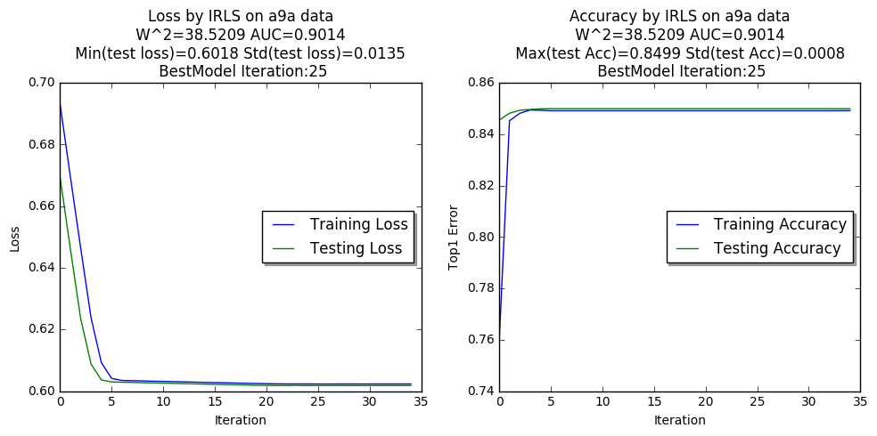
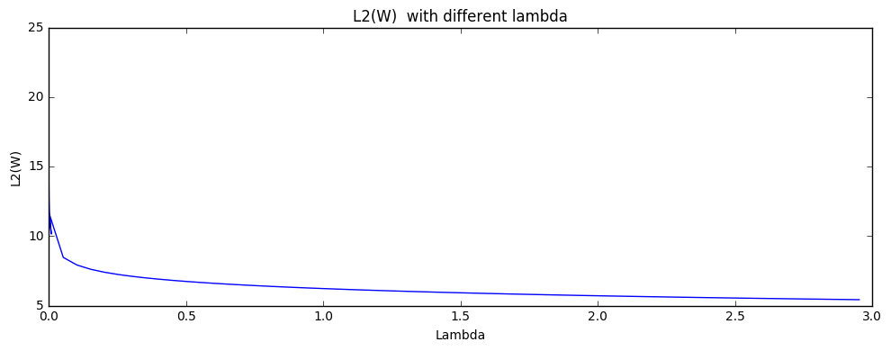

# IRLS(L2 norm) for Logistic Regression
L2 normalized Iterative Reweighted Logistic Regression code on UCI a9a dataset

## Usage

Run the examples
 
<code>
python IRLS.py
</code>

Use IRLS functions

~~~~ 
import IRLS

x_train, y_train  = IRLS.loadDotData("a9a/a9a")
x_test,  y_test   = IRLS.loadDotData("a9a/a9a.t")

# Run IRLS
trainHistory = IRLS.train(x_train, y_train, x_test, y_test)
IRLS.test(x_test, y_test, regularizer="")
IRLS.plotLossAcc(trainHistory,"IRLS on a9a data")

# Run IRLS with L2 norm regularized
trainHistoryL2 = IRLS.train(x_train, y_train, x_test, y_test, \
regularizer="L2", w_lambda= 0.3)
IRLS.test(x_test, y_test, regularizer="L2")
IRLS.plotLossAcc(trainHistory,"IRLS-L2 on a9a data")

~~~~ 

The output log:

~~~~ 
===== IRLS  ====
Max Iteration:  50
Early Stopping: 10

[ 0/50] best model from 99999.000000 to 0.669441 
 | trainLoss 0.6931   trainAcc 0.7592   valLoss 0.6694   valAcc 0.8455
[ 1/50] best model from 0.669441 to 0.646152 
 | trainLoss 0.6696   trainAcc 0.8452   valLoss 0.6462   valAcc 0.8482
[ 2/50] best model from 0.646152 to 0.623514 
 | trainLoss 0.6464   trainAcc 0.8482   valLoss 0.6235   valAcc 0.8493
[ 3/50] best model from 0.623514 to 0.608796 
...
[ 14/50] best model from 0.602329 to 0.602253 
 | trainLoss 0.6028   trainAcc 0.8491   valLoss 0.6023   valAcc 0.8499
[ 15/50] best model from 0.602253 to 0.602187 
 | trainLoss 0.6027   trainAcc 0.8491   valLoss 0.6022   valAcc 0.8499
...
[ 25/50] best model from 0.601798 to 0.601796 
 | trainLoss 0.6023   trainAcc 0.8491   valLoss 0.6018   valAcc 0.8499
[ 26/50] model is not improved
...
Stoped by earlystoping, best model loss: 0.6018 in Iteration 25 

 Testing IRLS  Loading Best model...
 * testACC: 0.8499  - testAUC: 0.9014 - testAP: 0.7450 - testF1: 0.6531 - 
 testPrecision: 0.7194 - testRecall: 0.5980 - L2norm: 38.5209
~~~~ 

## Plot

~~~~
IRLS.plotLossAcc(trainHistory,"IRLS-L2 on a9a data")
~~~~

## Acknowledge
Kui XU 
xukui.cs@gmail.com